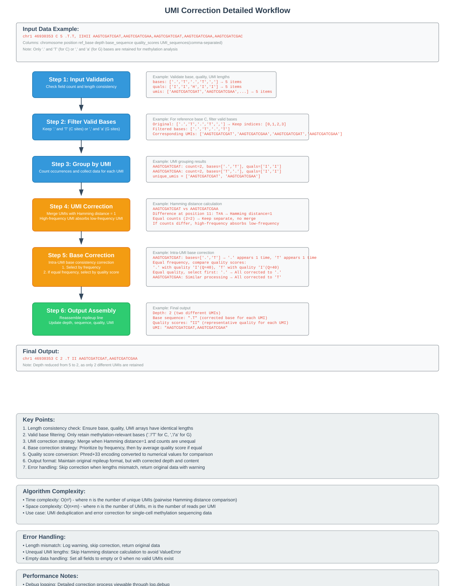

# ALLCools

[](https://github.com/lhqing/allcools/actions/workflows/test.yml)
[](https://lhqing.github.io/ALLCools/intro.html)
[](https://github.com/lhqing/ALLCools)

## About This Fork

This is a forked version of ALLCools maintained by **Seekgene Biotechnology**. We have made specific modifications to the `bam-to-allc` functionality to better suit our methylation data analysis needs.

## Overview

ALLCools is a comprehensive toolkit for single-cell methylation data analysis. It provides a complete workflow from raw sequencing data to downstream analysis, supporting various methylation data formats and analysis methods.

## Key Features

- **Data Preprocessing**: Support for ALLC format file generation, merging, and quality control
- **Methylation Analysis**: Analysis tools for mCG, mCH and other methylation patterns
- **UMI and Strand Correction**: High-precision UMI deduplication and strand-specific correction
- **Downstream Analysis**: Including differential methylated region (DMR) detection, clustering analysis, etc.
- **Visualization**: Rich charts and visualization capabilities

## Seekgene Modifications

### Enhanced bam-to-allc Pipeline

We have implemented significant improvements to the `bam-to-allc` conversion process:

#### UMI Correction Algorithm
- **Enhanced UMI deduplication**: Added function to deduplication based on UMI tag

#### Technical Details
For detailed information about our UMI correction workflow, please refer to the comprehensive diagram:


This diagram illustrates:
- Input data processing steps
- UMI grouping and deduplication logic
- Base correction algorithms
- Quality control checkpoints
- Output assembly process

#### New Command Line Parameters

**Enhanced bam-to-allc Parameters:**
- `--tag`: Tag name to extract from BAM file using samtools mpileup --output-extra
  - Common tags include: 'UR' for raw UMI sequences. Do not use 'CB', because it is corrected cell barcode already.
  - When specified, tag values are included in mpileup output for UMI-based error correction
  - Example: Using 'UR' enables UMI correction with 1 edit distance tolerance
- `--debug`: Enable debug mode for troubleshooting
  - Creates additional files to store mpileup output for debugging purposes
  - Generates `*_mpl_old.txt` and `*_mpl_correction.txt` files for analysis

**Optimized samtools mpileup Parameters:**
We have enhanced the mpileup command with additional parameters to fix mpileup output:
```bash
--no-output-ins-mods --no-output-ins --no-output-ins --no-output-del --no-output-del --no-output-ends
```
These parameters:
- `--no-output-ins-mods`: don't display base modifications within insertions.
- `--no-output-ins`: skip insertion sequence after +NUM. Use twice for complete insertion removal.
- `--no-output-del`: skip deletion sequence after -NUM. Use twice for complete deletion removal.
- `--no-output-ends`: remove ^MQUAL and $ markup in sequence column.

This optimization reduces noise in the mpileup output and focuses on the essential methylation information.

## Installation

### Prerequisites

Before installing ALLCools, ensure you have the following system requirements:
- Python 3.8 or higher
- Git (for cloning the repository)

### Method 1: Install from Source (Recommended for Seekgene Fork)

Since this is a forked version with Seekgene-specific modifications, we recommend installing from source:

```bash
# Clone the Seekgene fork
git clone https://github.com/seekgene/ALLCools.git
cd ALLCools

# Create and activate a conda environment (recommended)
conda env create -f environment.yml
conda activate allcools_dev

# Install ALLCools
pip install .
```
## Documentation

Complete usage documentation is available at: [https://lhqing.github.io/ALLCools/intro.html](https://lhqing.github.io/ALLCools/intro.html)

## Version History

### v1.2.0 (Current Version - Seekgene Fork)
- Updated project version to 1.2.0
- **Enhanced bam-to-allc functionality**:
  - Added UMI-based error correction and deduplication
  - Added comprehensive UMI workflow documentation

### v1.1.1 (Original)
- Stable version with basic functionality

## Contributing

We welcome Issues and Pull Requests to help improve ALLCools. For Seekgene-specific modifications, please contact us directly.

## License

Please see the LICENSE file for license information.

## Citation

If you use ALLCools in your research, please cite the relevant papers. For Seekgene modifications, please also acknowledge our contributions.

## Contact

For questions or suggestions:
- General ALLCools issues: GitHub Issues
- Seekgene-specific modifications: Contact Seekgene Biotechnology

## Acknowledgments

- Original ALLCools developers for the excellent foundation
- Seekgene Biotechnology team for the enhanced bam-to-allc implementation


